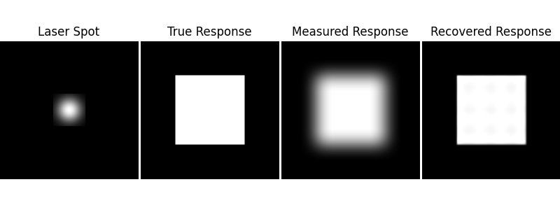

## Symmetry in Problem Solving
Physicists are trained to notice and exploit physical [symmetry](https://en.wikipedia.org/wiki/Symmetry_(physics)) to solve problems. From Wikipedia, "a symmetry of a physical system is a physical or mathematical feature of the system (observed or intrinsic) that is preserved or remains unchanged under some transformation." If we are able to identify some essential feature that is the same between two systems, then we can apply the tools developed for one system to the other.

Here, we're going to explore the exsistence of symmetry between a problem in photodiode development and a problem in micrsocopy. If symmetry exists, then common image processing software employed in microscopy can be used to help us study photodiode behavior.

## Photodiode Response Maps
Photodiodes are devices that accept photons and output an electrical current. They can be tailored to a variety of wavelengths including ultraviolet, visible, and infrared. They're used as part of the [CMOS imagers in your smartphone](https://en.wikipedia.org/wiki/Active-pixel_sensor), and they can be specialized for applications such as [single-photon detection](https://en.wikipedia.org/wiki/Single-photon_avalanche_diode) and can even be applied to sensing particles other than photons, such as [high energy electrons in 4D-STEM microscopy](https://arxiv.org/abs/2111.05889).

Photodiodes have a sensing surface that can be smaller than 1 &mum<sup>2</sup> or greater than 1 cm<sup>2</sup>. In an ideal photodiode, the amount of current that's generated will be independent of the location that the photons land on. In practice, the response may be inhomogenous, such as having increased or decreased sensitivity at the edges compared to the center. I wish to make response maps of photodiodes in order to reveal any inhomogeneities for further development. Here are some response maps from [a CERN sensor for high energy physics](https://journals.jps.jp/doi/pdf/10.7566/JPSCP.34.010009).


Making a response map can very simple: Simply scan a small laser beam across the surface of the device and measure the electric current at each point. This works very well so long as the size of the spot is much smaller than the device.

There are cases when the laser beam is not guaranteed to be much smaller than the device. The smallest spot of light we can typically generate is limited by diffraction, so it ends up being an [Airy disk](https://en.wikipedia.org/wiki/Airy_disk), whose size increases with wavelength and decreases as numerical aperture is increased. For microsocpe objectives, Airy disk sizes on the order of microns are typical.


So suppose that we can generate an Airy disk that is approximately 1/10th the size of the photodiode. We would then be able to make a response map with approximately 10x10 resolution by simply stepping the Airy disk across the device. But what if we want higher resolution, and we're unable to shrink the light spot size any further? This problem sounds analagous to a problem found in microscopy.

## Deconvolution in Microscopy
In microscopy, images typically contain some amount of blur due to the fundamental limit of the optics used. Perfect optics would map a single point of data from the sample to a single point on the detector. However, optical imperfections and diffraction limits cause the information from a point in the sample to be smeared across some area on the detector. This effect can be modelled by  a [point spread function (PSF)](https://en.wikipedia.org/wiki/Point_spread_function) that describes how each point in an image is smeared. When microscopists are able to measure or estimate the PSF, they can use [deconvolution algorithms](https://imagej.net/imaging/deconvolution) to regain some of the contrast that is lost by blurring. [This paper](http://bigwww.epfl.ch/publications/lefkimmiatis1302.html) demonstrates a *(a)* blurry image of a floursecent cell being deconvolved *(c & d)* to generate images closer to the ground truth *(b)*.


The technique can be extended to consider the 3-D PSF and devonvolve image stacks to [recover 3D details](http://bigwww.epfl.ch/deconvolution/).


## Theoretical Basis for Improving a Response Map
If we scan a laser spot across the photodiode, and we measure the electrical current from the photodiode at each point of the scan, we will end up with a response map that is [convolved](https://en.wikipedia.org/wiki/Convolution) with the size and shape of the laser spot. The 1-D illustration below shows how movement generates a convolved response. Applied to our case, the blue curve represents the response of some region of the photodiode, the red curve represents the laser spot, and the black curve represents the convolved function that we'd actually measure as electric current. As the laser scans across the device, the overlap of the laser spot and the device changes, and so the current generated changes.


The example above shows that convolution is a continuous integral operation. In the case of widefield microsopy, the convolution is "perfect" in the sense that each of the inifinite points in the sample plane is transformed by the PSF on its way to the detector plane. However, in our case, the quality of our convolution will depend on the step sizes that we take with the scanning laser. We will need to step the laser spot in steps that are much smaller than the laser spot itself.

This 1-D example of convolution is directly applicable to the knife edge technique used to profile laser beams, as shown in the figure below from [this paper](https://opg.optica.org/oe/fulltext.cfm?uri=oe-21-21-25069). If the laser beam is known, symmetry can be used to measure the detector. With the code below, we will explore what it looks like to generalize this to two dimensions.


## Deconvolution Example
Let's begin by testing a [textbook example](https://scikit-image.org/docs/stable/auto_examples/filters/plot_deconvolution.html) of PSF deconvolution.

```python
import numpy as np
import matplotlib.pyplot as plt

from scipy.signal import convolve2d as conv2

from skimage import color, data, restoration

rng = np.random.default_rng()

astro = color.rgb2gray(data.astronaut())

psf = np.ones((5, 5)) / 25
astro = conv2(astro, psf, 'same')
# Add Noise to Image
astro_noisy = astro.copy()
astro_noisy += (rng.poisson(lam=25, size=astro.shape) - 10) / 255.

# Restore Image using Richardson-Lucy algorithm
deconvolved_RL = restoration.richardson_lucy(astro_noisy, psf, num_iter=30)

fig, ax = plt.subplots(nrows=1, ncols=3, figsize=(8, 3.5))
plt.gray()

for a in (ax[0], ax[1], ax[2]):
       a.axis('off')

ax[0].imshow(astro)
ax[0].set_title('Original Data')

ax[1].imshow(astro_noisy)
ax[1].set_title('Noisy data')

ax[2].imshow(deconvolved_RL, vmin=astro_noisy.min(), vmax=astro_noisy.max())
ax[2].set_title('Restoration using\nRichardson-Lucy')


fig.subplots_adjust(wspace=0.02, hspace=0.2,
                    top=0.9, bottom=0.05, left=0, right=1)
plt.show()
```


## Response Map Enhancement with Simulated Data
Now, let's model a photodiode being scanned by a laser.
#### Photodiode
We'll model the photodiode as a square with perfectly homogenous response across its entire area.
#### Ideal Response Map
The ideal response map is what we would measure if we had a laser spot perfectly matched to the step size of the laser as we scan it across the device. For an infinite number of sample points, we'd have an infinitely smaller laser spot.

We model the ideal response map for a system that samples 512x512 positions with the laser. The central 256x256 region depicts the ideal photodiode. The response is 1 in this central region and 0 elsewhere.
#### PSF
As discussed, the laser spot act as the PSF. In a diffraction limited system, the laser spot would be an Airy disk. The central region of an Airy disk is a Gaussian distribution that contains 84% of the total laser energy. For simplicity, we will use a Gaussian distibution to model the PSF.

We suppose that our laser spot has dimensions comparable to the photodiode. The FWHM size of the spot is about 60 length units compared the photodiode being 256x256 units in size. So when we step the laser spot by 120 steps and acquire 120 data points from the photodiode, we will have displaced the laser spot by its entire width. This is the essence of convolution, and letting the step size be much less than the spot size approximates continuity within the integral.
#### Measured Response Map
We will simulate the measured response map by convolving the PSF with the Ideal Response Map. The measured response map that we simulate contains all of the features that we expect in a a measured data set:
1. For laser positions far away from the photodiode, the response is zero.
1. For laser positions well inside the photodiode, the response is one.
1. For laser positions centered just outside of the photodiode, we measure a small response because the edge of the laser spot is landing on the photodiode.
1. For laser positions centered just inside the edge of the photodiode, we measure an appreciable response, but some response is lost because the edge of the laser spot is landing off of the photodiode.

#### Recovered Response Map
We use the Richardson Lucy algorithm to recover an estimate of the ideal response map. We note that deconvolution is an imperfect process and that we'll have to take care when interpreting any "recovered" data set.

```python
import numpy as np
import matplotlib.pyplot as plt
import scipy.stats as st
from scipy.signal import convolve2d as conv2
from numpy.fft import fftn, ifftn, fftshift 
from skimage import color, data, restoration

"""Returns a 2D Gaussian kernel."""
def gkern(kernlen=5, nsig=3):
    x = np.linspace(-nsig, nsig, kernlen+1)
    kern1d = np.diff(st.norm.cdf(x))
    kern2d = np.outer(kern1d, kern1d)
    return kern2d/kern2d.sum()

# In our true response map, the photodiode is represented by the 256x256 array
# with response value = 1. The border region has response value = 0.
size = (256,256)
pad_width = 128
truth_response_map = np.ones(size)
truth_response_map = np.pad(truth_response_map, pad_width, mode='constant', constant_values=0)

# Define our Point Spread Function to be a Gaussian Spot
psf = np.ones((10, 10)) / 100
psf_size = 120
psf = gkern(psf_size,2)

# Simulate the measured response map
convolved_response_map = conv2(truth_response_map, psf, 'same')

# Pad PSF for direct visual size comparison to the response map
psf_pad_width = int((pad_width * 2 + size[0] - psf_size) / 2)
psf_padded = np.pad(psf, psf_pad_width, mode='constant', constant_values=0)

# Restore response map using Richardson-Lucy algorithm
number_iterations = 250
deconvolved_RL = restoration.richardson_lucy(convolved_response_map, psf, number_iterations)


fig, ax = plt.subplots(nrows=1, ncols=4, figsize=(8, 3))
plt.gray()

for a in (ax[0], ax[1], ax[2], ax[3]):
       a.axis('off')

ax[0].imshow(psf_padded)
ax[0].set_title('Laser Spot')

ax[1].imshow(truth_response_map)
ax[1].set_title('True Response')

ax[2].imshow(convolved_response_map)
ax[2].set_title('Measured Response')

ax[3].imshow(deconvolved_RL, vmin=astro.min(), vmax=astro.max())
ax[3].set_title('Recovered Response')


fig.subplots_adjust(wspace=0.02, hspace=0.2,
                    top=0.9, bottom=0.05, left=0, right=1)
plt.show()
```



## Conclusion
This result indicates promise for recovering response maps of photodiodes. We note that the result is imperfect. To implement this technique in an actual experiment would require extreme care regarding:
1. The deconvolution algorithm chosen
1. Step size of the laser spot
1. Estimating errors in reconstruction
1. How changes in the PSF and in the Ground Truth affect error

With so much [prior work](http://bigwww.epfl.ch/deconvolution/) in deconvolution for microscopy, it seems likely that existing algorithms could be adapted to this problem. Note that while deconvolution in microscopy is often thought of as widefield approach, [confocal implementations](https://doi.org/10.1002/jemt.20294) exist as well. This is particularly relevant to characterizing photodiodes, as the process of stepping a laser spot is essentially a confocal approach.

We expect this technique to be useful when:
1. The wavelength and aperture are such that we are limited by the spot size that we are able to project. This may occur in infrared systems which have long wavelengths and which rely on specizlized optics that may preclude using the [fast optics](https://en.wikipedia.org/wiki/Lens_speed) typically used to achieve minimum-sized Airy disks in more forigiving poritions of the spectrum.
1. We are able to move the projected light spot in step sizes that are much smaller than the size of the light spot itself.

## Acknowledgements
This idea was inspired by a discussion with Kevan and his work [performing deconvolution with signal-dependent PSFs in astronomy](https://arxiv.org/pdf/1805.09413.pdf).
