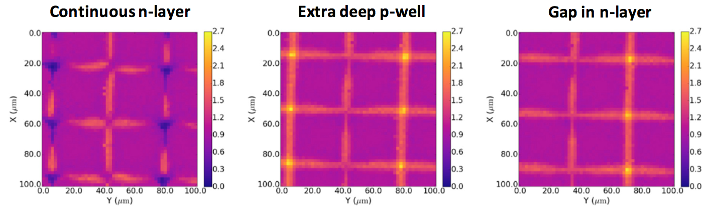

## Symmetry in Problem Solving
Physicists are trained to notice physical symmetry and exploit it to solve problems. When one can identify that some essential feature is the same in two different systems, then the tools and techniques developed to solve problems in the first system can be applied to solve problems in the second system.

We do this intuitively all the time. When we encounter a keyboard, it doesn't matter whether it's on a laptop, phone, or typewriter. We know what to expect when we press the keys because we're familiar with the essence of a keyboard. Challenges may arise when a feature that appears to be preserved has actually shifted subtly, such as if the keyboard appears familiar, but has actually been set up to type out foreign characters. The fun often begins in situations when we suspect that sufficient symmetry exists to help us, but it's not immediately obvious. 

>"A symmetry of a physical system is a physical or mathematical feature of the system (observed or intrinsic) that is preserved or remains unchanged under some transformation."  -[Wikipedia entry on symmetry](https://en.wikipedia.org/wiki/Symmetry_(physics))

Here, we're going to explore the exsistence of symmetry between a problem in photodiode development and a problem in micrsocopy. If symmetry exists, then common image processing software employed in microscopy could be used to help us improve photodiode designs and processing techniques.

## Photodiode Response Maps
Photodiodes are highly ubiquitous devices that measure incoming photons. They're used as part of the [CMOS imagers in your smartphone](https://en.wikipedia.org/wiki/Active-pixel_sensor). They can be specialized for applications such as [single-photon detection](https://en.wikipedia.org/wiki/Single-photon_avalanche_diode) and can even be applied to sensing particles other than photons, such as [high energy electrons in 4D-STEM microscopy](https://arxiv.org/abs/2111.05889).

Photodiodes have a sensing surface that can be smaller than 1 &mu;m<sup>2</sup> or greater than 1 cm<sup>2</sup>. Typically, designers want photodiodes to have uniform response across the entire area of the device, so that photons landing on one part of the device generate the same signal as photons landing on another part of the device. In practice, the response may be inhomogenous, such as having increased or decreased sensitivity at the edges compared to the center. Response maps are used to visualize any inhomogeneities within the photodiode and help improve the design.

Here are some response maps from [a CERN sensor for high energy physics](https://journals.jps.jp/doi/pdf/10.7566/JPSCP.34.010009):



Making a response map can very simple: Simply scan a small laser beam across the surface of the device and measure the electric current for each position. This works very well so long as the size of the spot is much smaller than the device.

There are cases when the laser spot is not as small as the scale that we wish to observe performance at. The smallest spot of light we can typically generate is limited by diffraction, so it ends up being an [Airy disk](https://en.wikipedia.org/wiki/Airy_disk), whose size increases with wavelength and decreases as numerical aperture is increased. For microsocpe objectives and visible wavelengths, Airy disk sizes on the order of microns are typical whereas a photodiode designer may wish to observe performance at scales that are an order of manitude or two finer than that.


So suppose that we can generate an Airy disk that is approximately 1/10th the size of the photodiode. We would then be able to make a response map with approximately 10x10 resolution by simply stepping the Airy disk across the device. However, if we desire higher resolution and we're unable to shrink the light spot any further, what can be done? This problem sounds analagous to a problem found in microscopy.

## Deconvolution in Microscopy
In microscopy, images typically contain some amount of blur due to the fundamental limit of the optics used and light scattered by regions of the sample other than the exact point of interest. A perfect microscope would map a single point of data from the sample to a single point on the detector. However, scattering and diffraction limits cause the information from a point in the sample to be smeared across some area on the detector. This effect can be modelled by  a [point spread function (PSF)](https://en.wikipedia.org/wiki/Point_spread_function) that describes how each point in an image is smeared. When microscopists are able to measure or estimate the PSF, they can use [deconvolution algorithms](https://imagej.net/imaging/deconvolution) to regain some of the contrast that is lost by blurring. [This paper](http://bigwww.epfl.ch/publications/lefkimmiatis1302.html) demonstrates a *(a)* blurry image of a floursecent cell being deconvolved *(c & d)* to generate images closer to the ground truth *(b)*.


The technique can be extended to consider the 3-D PSF and devonvolve image stacks to [recover 3D details](http://bigwww.epfl.ch/deconvolution/).


## Theoretical Basis for Improving a Response Map
If we scan a laser spot across the photodiode, and we measure the electrical current from the photodiode at each point of the scan, we will end up with a response map that is [convolved](https://en.wikipedia.org/wiki/Convolution) with the size and shape of the laser spot. The 1-D illustration below shows how movement generates a convolved response. Applied to our case, the blue curve represents the response of some region of the photodiode, the red curve represents the laser spot, and the black curve represents the convolved function that we'd actually measure as electric current. As the laser scans across the device, the overlap of the laser spot and the device changes, and so the current generated changes.


This example shows that convolution is a continuous integrating operation. In the case of widefield microsopy, the convolution is "perfect" in the sense that each of the inifinite points in the sample plane is transformed by the PSF on its way to the detector plane. However, in our case of step-scanning to make a response map, the quality of our convolution will depend on the step sizes that we take while scanning the laser. We will need to step the laser spot in steps that are much smaller than the laser spot itself and at least as small as the features we wish to resolve in the response map. Doing so will give us enough data to approximate a continuous convolution and apply discrete calculus.

This 1-D example of convolution is directly applicable to the knife edge technique used to profile laser beams using a known detector, as shown in the figure below from [this paper](https://opg.optica.org/oe/fulltext.cfm?uri=oe-21-21-25069). By symmetry, if the laser beam is known, the detector can be measured. With the code below, we will explore what it looks like to generalize this concept to two dimensions.


## Deconvolution Example
Let's begin by testing a [textbook example](https://scikit-image.org/docs/stable/auto_examples/filters/plot_deconvolution.html) of PSF deconvolution.

```python
import numpy as np
import matplotlib.pyplot as plt

from scipy.signal import convolve2d as conv2

from skimage import color, data, restoration

rng = np.random.default_rng()

astro = color.rgb2gray(data.astronaut())

psf = np.ones((5, 5)) / 25
astro = conv2(astro, psf, 'same')
# Add Noise to Image
astro_noisy = astro.copy()
astro_noisy += (rng.poisson(lam=25, size=astro.shape) - 10) / 255.

# Restore Image using Richardson-Lucy algorithm
deconvolved_RL = restoration.richardson_lucy(astro_noisy, psf, num_iter=30)

fig, ax = plt.subplots(nrows=1, ncols=3, figsize=(8, 3.5))
plt.gray()

for a in (ax[0], ax[1], ax[2]):
       a.axis('off')

ax[0].imshow(astro)
ax[0].set_title('Original Data')

ax[1].imshow(astro_noisy)
ax[1].set_title('Noisy data')

ax[2].imshow(deconvolved_RL, vmin=astro_noisy.min(), vmax=astro_noisy.max())
ax[2].set_title('Restoration using\nRichardson-Lucy')


fig.subplots_adjust(wspace=0.02, hspace=0.2,
                    top=0.9, bottom=0.05, left=0, right=1)
plt.show()
```


## Improving resolution of the response map
Now, let's model a photodiode being scanned by a laser.
#### Photodiode
We'll model the photodiode as a square with perfectly homogenous response across its entire area. In our code, it will be represented by a 256x256 grid where the response equals one.
#### Ideal Response Map
The ideal response map is what we would measure if we had a laser spot whose size is identical to the step size of the laser. For an infinite number of sample points, we'd have an infinitely smaller laser spot.

We model the ideal response map for a system that samples 512x512 positions with the laser. The central 256x256 region depicts the ideal photodiode. The response is one in this region. Positions sampled outside of this region represent cases when the laser is landing off the edge of the device. The response in this border region is zero.
#### Laser Spot Scanning
Whereas the size of the laser spot in our idealized respones map is represented by a single pixel, we are studying the case when the laser spot is not much smaller than the photodiode. In a diffraction limited system, the laser spot would be an Airy disk. The central region of an Airy disk is a Gaussian distribution that contains 84% of the total laser energy. For simplicity, we will use a Gaussian distibution to model the laser spot.

We define a 200x200 array with a Gaussian distribution such that almost all of the energy is contained in the central region with 150 pixel diameter. We let this represent the laser spot.

We will let the step size be equal to the pixel size. That is, we'll let the discrete convolution be generated by stepping the laser spot across all 512x512 positions represented in the model. We'll calculate the measured response map using a convolution function.
#### Response Map Recovery
We'll use the Richardson-Lucy algorithm to deconvolve the measured response map with the laser spot. We expect to recover a higher resolution response map than is possible without the deconvolution operation.

```python
import numpy as np
import matplotlib.pyplot as plt
import scipy.stats as st
from scipy.signal import convolve2d as conv2
from numpy.fft import fftn, ifftn, fftshift 
from skimage import color, data, restoration

"""returns a 2d gaussian kernel."""
def gkern(kernlen, nsig):
    x = np.linspace(-nsig, nsig, kernlen+1)
    kern1d = np.diff(st.norm.cdf(x))
    kern2d = np.outer(kern1d, kern1d)
    return kern2d/kern2d.sum()

# in our true response map, the photodiode is represented by the 256x256 array
# with response value = 1. the border region has response value = 0.
size = (256,256)
pad_width = 180
truth_response_map = np.ones(size)
truth_response_map = np.pad(truth_response_map, pad_width, mode='constant', constant_values=0)

# define our laser spot to be a gaussian spot
spot_array_size = 240
spot = gkern(spot_array_size,2.75)

# simulate the measured response map
convolved_response_map = conv2(truth_response_map, spot, 'same')

# pad spot for direct visual size comparison to the response map
spot_pad_width = int((pad_width * 2 + size[0] - spot_array_size) / 2)
spot_padded = np.pad(spot, spot_pad_width, mode='constant', constant_values=0)

# restore response map using richardson-lucy algorithm
number_iterations = 128
deconvolved_rl = restoration.richardson_lucy(convolved_response_map, spot, number_iterations)


fig, ax = plt.subplots(nrows=1, ncols=4, figsize=(8, 3))
#plt.gray()

for a in (ax[0], ax[1], ax[2], ax[3]):
       a.axis('off')

ax[0].imshow(spot_padded)
ax[0].set_title('laser spot')

ax[1].imshow(truth_response_map)
ax[1].set_title('true response')

ax[2].imshow(convolved_response_map)
ax[2].set_title('measured response')

ax[3].imshow(deconvolved_rl, vmin=deconvolved_rl.min(), vmax=deconvolved_rl.max())
ax[3].set_title('recovered response')


fig.subplots_adjust(wspace=0.02, hspace=0.2,
                    top=0.9, bottom=0.05, left=0, right=1)
plt.show()
```


## Evaluating the output
#### Measured Response Map
The measured response map that we simulate contains all of the features that we expect in an actual measured data set:
1. For laser positions far away from the photodiode, no light lands on the photodiode. The response is zero.
1. For laser positions well inside the photodiode, all light lands on the photodiode. The response is one.
1. For laser positions centered just outside of the photodiode, the edge of the laser spot lands on the photodiode while most of the light misses the photodiode. We measure a small response.
1. For laser positions centered just inside the edge of the photodiode, most light lands on the photodiode, but the edge of the spot misses the photodiode. We measure a response less than one as some light is lost.

#### Recovered Response Map
We use the Richardson-Lucy algorithm to recover an estimate of the true response map. We note that deconvolution is an imperfect process and that we'll have to take care when interpreting any "recovered" data set. Nevertheless, the recovered response map is much closer to ground truth than the measured response map.

## Conclusion
This result indicates promise for recovering response maps of photodiodes at resolutions finer than the diffraction limit of the interrogating system. We note that the result is imperfect. To implement this technique in an actual experiment would require extreme care regarding:
1. The choice of deconvolution algorithm and tuning parameters
1. Estimating errors in reconstruction
1. How variables such as spot size, step size, and ground truth structure affect the error.

We expect this technique may be useful when:
1. The wavelength and numerical aperture are such that we are forced to interrogate the photodiode with a spot that is larger than the features we wish to study.
1. We are able to move the projected light spot in step sizes as small as the features we wish to study.

With so much [prior work](http://bigwww.epfl.ch/deconvolution/) in deconvolution for microscopy, it seems likely that existing algorithms could be adapted to this problem. Note that while deconvolution in microscopy is often thought of as widefield approach, [confocal implementations](https://doi.org/10.1002/jemt.20294) exist as well. Deconvolution algorithms used in confocal microscopy may be particularly relevant to characterizing photodiodes since the process of stepping a laser spot is essentially a confocal approach. In fact, the symmetry is so complete that one could consider generating a photodiode response map with a laser spot to be a form of confocal microscopy in which the measured signal is electrons from the device rather than photons from the sample.
## Acknowledgements
This idea was inspired by a discussion with Kevan and his work [performing deconvolution with signal-dependent PSFs in astronomy](https://arxiv.org/pdf/1805.09413.pdf).
